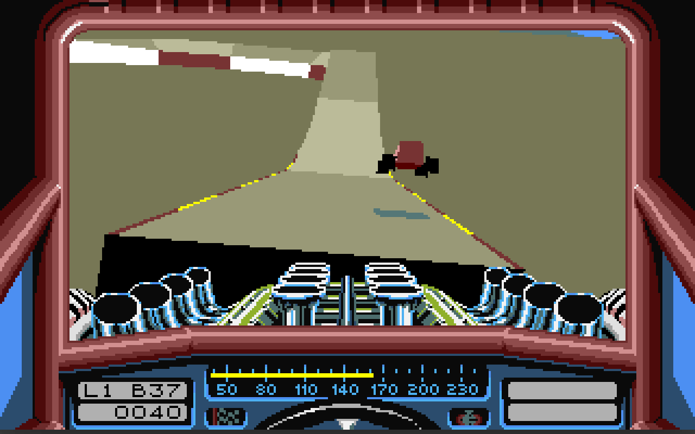
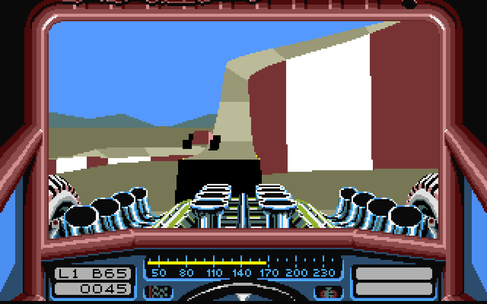
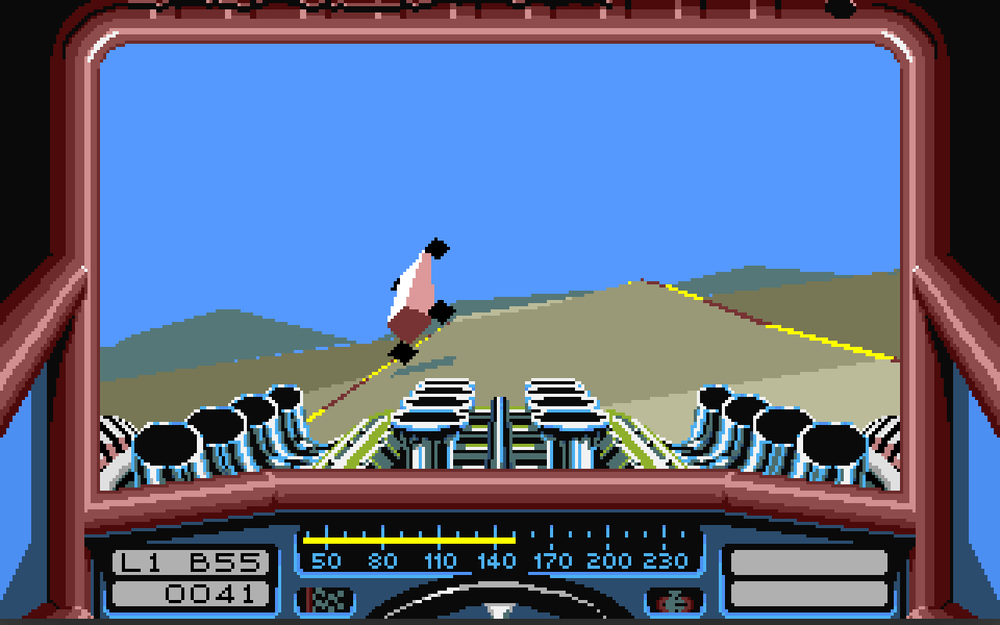

# Kaskadeurrennfahrer

## This is a fork of "stuntcarremake" alias "Stunt Car Racer", which is a remake of the legendary game from the AtariST/Amiga time from Geoff Crammond.

To build on Linux and Windows, simply use `make`. 
For RaspberryPI `make RPI=1` 
and you can try PANDORA=1, PYRA=1, ODROID=1, ODROIDN1=1, CHIP=1 for this platforms. 
 
It supports keyboard, gamepad (and only under OpenGL/SDL2). 
 
On keyboard: 
 `4 Arrows` Turning / Accelerate / Brake 
 `Space`    Boost 
 `m`        back to track menu 
 
On gamepad: 
 `4 Arrows` Turning / Accelerate / Brake 
 `A`        Boost 
 `B`        back to track menu 
 
My test hardware is a AMD laptop with Ubuntu/Windows11 and RaspberryPi400/TV(720x480@60Hz) and a 8BitDo lite gamepad. 
 
Original project is here: https://github.com/ptitSeb/stuntcarremake 
 

 
 
